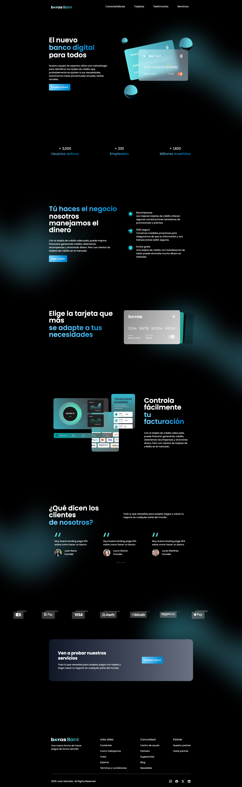

# Landing Page Bank - Moderna y Dinámica

[](https://vercel.com/new/clone?repository-url=https://github.com/tu-usuario/tu-repo)
[](https://stackblitz.com/github/tu-usuario/tu-repo)



Una landing page moderna para servicios bancarios, con animaciones fluidas y diseño responsive, construida con:

- ⚡️ Astro para rendimiento óptimo
- 🎨 Tailwind CSS para estilos
- 🚀 React para componentes interactivos
- ✨ Framer Motion y Swiper para animaciones
- 🏗 TypeScript para tipado seguro
- ⚡ Bun como runtime y gestor de paquetes

## 🚀 Características Principales

- Diseño moderno y atractivo
- Responsive
- Animaciones con Framer Motion
- Carrusel interactivo con Swiper
- Despliegue con Vercel
- Optimizado para SEO y rendimiento

## 🏗 Estructura del Proyecto

```text
/
├── public/               # Assets estáticos
│   ├── image.png         # Imagen principal
│   └── favicon.svg       # Favicon
├── src/
│   ├── assets/           # Recursos multimedia
│   ├── components/       # Componentes reutilizables
│   │   ├── BackgroundRadial/  # Efectos de fondo
│   │   ├── ControlBilling/    # Sección de facturación
│   │   ├── Footer/            # Pie de página
│   │   ├── Header/            # Cabecera
│   │   └── ...                # Más componentes
│   ├── layouts/          # Layouts principales
│   ├── pages/            # Páginas de la aplicación
│   ├── styles/           # Estilos globales
│   └── utils/            # Funciones utilitarias
├── astro.config.mjs      # Configuración de Astro
├── tsconfig.json         # Configuración de TypeScript
└── package.json          # Dependencias del proyecto
```

## 🌐 Despliegue

[](https://vercel.com)
[](https://github.com/tu-usuario/tu-repo)

El proyecto está configurado para despliegue automático en Vercel:

1. Haz push a tu repositorio GitHub
2. Conecta tu repositorio en [Vercel](https://vercel.com)
3. ¡Listo! El despliegue se realizará automáticamente

[](https://vercel.com/new/clone?repository-url=https://github.com/tu-usuario/tu-repo)

## 📚 Tecnologías Utilizadas

[](https://astro.build)
[](https://react.dev)
[](https://www.typescriptlang.org)
[](https://tailwindcss.com)
[](https://www.framer.com/motion/)
[](https://swiperjs.com)
[](https://bun.sh)

| Tecnología | Descripción |
|------------|-------------|
| [Astro](https://astro.build) | Framework web estático ultra-rápido |
| [React](https://react.dev) | Biblioteca para componentes UI interactivos |
| [TypeScript](https://www.typescriptlang.org) | JavaScript con tipado estático |
| [Tailwind CSS](https://tailwindcss.com) | Framework CSS utility-first |
| [Framer Motion](https://www.framer.com/motion/) | Biblioteca de animaciones fluidas |
| [Swiper](https://swiperjs.com) | Carrusel interactivo moderno |
| [Bun](https://bun.sh) | Runtime JavaScript ultra-rápido |